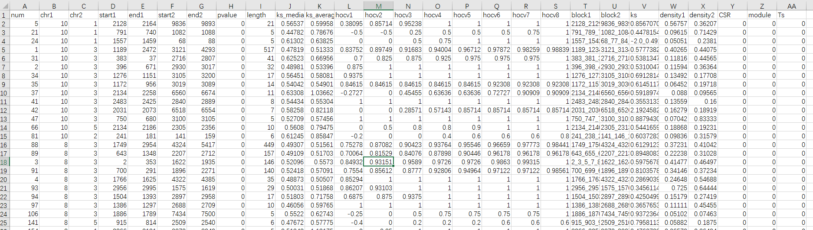
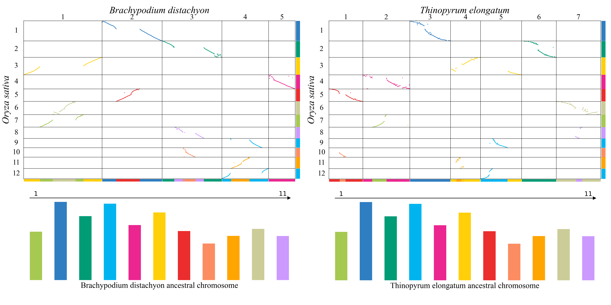

# AKRUP

## What is the importance of the constructing of the AKRUP pipeline?

Ancestral karyotype reconstruction is an important approach to understanding the rearrangement history of extant plant genomes. However, current ancestral karyotype reconstruction remains extremely challenging, and ancestral karyotype reconstruction methods have their own limitations and cannot be well applied to the inference of ancestral karyotypes in complex scenarios. In order to address the challenges in ancestral karyotype reconstruction, as well as to compensate for the shortcomings of existing methods, in this study, we developed a new Ancestral Karyotype Reconstruction Universal Pipeline (AKRUP). It can be well applied to infer ancestral karyotype of the investigated species 'bottom-up', and to analyze chromosomes evolutionary trajectory of extant species "top-down" using the constructed ancestors as a reference.

## AKRUP method for inferring ancestral karyotypes

**Core Principle:** 

For any two genomes and the outgroup (or reference genome), the continuous synteny region (CSRs) between the two genomes are first identified, and then the linkage patterns of these CSRs in the genomes under consideration are compared. CSRs with a consistent linkage pattern between the two investigated genomes are presumed to be conservative ancestral regions (CARs), also known as paleochromosomes; while CSRs with inconsistent linkage patterns, but with a consistent linkage pattern with the outgroup (or reference genome), are presumed to be CARs. The ancestral karyotype of a particular species prior to a particular polyploidy event can also be presumed based on this principle.

**AKRUP six steps to construct the ancestral karyotype(Figure 1)：**

**(1)**  Anchor genes, also known as homologous genes, are searched for between or within the investigated genomes by homology alignment.

**(2)** Anchor genes are analyzed for collinearity analysis to identify synteny regions (SRs) between the investigated genomes.

**(3)** *Ks* analysis is performed on anchor gene pairs within the SR to identify evolutionary event-related peaks (*Ks* distribution).

**(4)** Combining *Ks* distributions with synthetic dotplots to identify evolutionary event-related synteny regions (ESRs).

**(5)** Using outgroups as a reference to identify maximal continuous synteny region (CSRs) between the investigated genomes.

**(6)** Conserved ancestral regions (CARs), also known as paleochromosomes, are inferred by determining CSR linkage patterns of between the investigated genomes and outgroups.

**Notes：**

Using outgroups as a reference, we found that the continuous remodelling of plant genomes after polyploidy often results in conserved long SRs breaking into multiple small SRs or experiencing severe gene loss in modern genomes. However, these small or gene-lost SRs still essentially belong to a CSR, and thus AKRUP still treats these ESRs as a whole, thereby minimising the impact of species-specific changes on ancestral karyotype inference.

**Figure 1. Ancestral karyotype reconstruction universal pipeline (AKRUP).**  The "bottom-up" inference of ancestral genome structure is divided into 6 main steps: inference of anchor genes, identification of synteny regions (SRs), *Ks* analysis, identification of event-related synteny regions (ESRs), maximal contiguous synteny regions (CSRs), and contiguous ancestral regions (CARs). *μ*1 and *μ*2 indicates the evolutionary event-related peaks (*Ks* distribution) between the outgroup with species A and B. Dashed circles in the synteny dotplot indicates gene loss. CSRO, CSRA, and CSRB indicates the identified CSRs among the outgroup, species A, and species B. Karyotype evolution indicates the "top-down" identification of paleochromosomes evolutionary trajectory.

## Ancestral karyotype reconstruction demonstration

### Inferring ancestral karyotypes

The polyploidization events and phylogenetic relationships of the major branches of the monocots are well known based on previous studies ([Jiao, Li, Tang, & Paterson, 2014](https://doi.org/10.1038/s41477-022-01187-x), [Wang et al., 2014](https://doi.org/10.1038/ncomms4311), [Shi et al., 2022](https://doi.org/10.1038/s41477-022-01187-x)) (Figure 2).

**Figure 2. Phylogenetic tree of 8 representative monocots and the outgroup *A. trichopoda*.**

Based on the AKRUP principle of "bottom-up" ancestral genome structure inference, we select three species (***Oryza sativa*****: Os**, ***Brachypodium distachyon*****: Bdi**, and ***Thinopyrum elongatum*****: Tel**)  in the innermost part of the phylogenetic tree as example to illustrate the detailed process of AKRUP inference.

+ The raw data for the three selected species were processed according to the scripts we provided.

  **For example：**

  **Os.new.gff**

  **①: chr**  The name of the scaffold or chromosome

  **②: start**  The starting position of the gene

  **③: end**  The termination position of the gene

  **④: strand**  "+" means that the sequence element is in the positive strand of the scaffold or chromosome, and "-" indicates that it is on the negative strand.

  **⑤: original ID**  ID name in gff3 file.

  **⑥: new ID**  ID of the new rule. The rule: `Species abbreviation + chr number + "g" + gene order`

  **⑦: gene order**  Genes are ordered according to the start in the scaffold or chromosome

  

  

  

  **Os.lens/Os.lens.txt**

  **①: chr**  The name of the scaffold or chromosome

  **②: chromosome length**  Chromosome physical length

  **③: gene num**  The number of genes on a scaffold or chromosome

  

  

  

+ Based on the processed data, using the -rb parameter of AKRUP, we run blast to search for anchor genes based on the phylogenetic tree with Os as the outgroup.

  `AKRUP -rb run_blast-Os_Bdi.conf`
  
  `AKRUP -rb run_blast-Os_Tel.conf`
  
  
  
  

+ We use AKRUP with the “-d” parameter to map the Os_Bdi and Os_Tel dotplots.

  `AKRUP -d blast_dotplot-Os_Bdi.conf`

  `AKRUP -d blast_dotplot-Os_Tel.conf`

  

+ The anchored genes were then analyzed for collinearity to identify synteny regions (SRs) using the `-rc` parameter of AKRUP.

  `AKRUP -rc run_ColinearScan-Os_Bdi.conf`

  `AKRUP -rc run_ColinearScan-Os_Tel.conf`

  
  
  
  

+ Based on the obtained the synteny blocks (SBs) file, we use AKRUP with the -bd parameter to map Os_Bdi, Os_Tel block dotplots to demonstrate the synteny regions (SRs).

  `AKRUP -bd block_dotplot-Os_Bdi.conf`

  `AKRUP -bd block_dotplot-Os_Bdi.conf`

  

+ Subsequently, *Ks* was calculated for gene pairs within the SRs using the `-rk` parameter of AKRUP.

  `AKRUP -rk run_ks-Os_Bdi.conf`

  `AKRUP -rk run_ks-Os_Tel.conf`

  
  
  
  
  

+ Based on the obtained the blast, block, and *Ks* files, use the -lk parameter of AKRUP to load this information together for later use.

  `AKRUP -rk Loadblock-Os_Bdi.conf`

  `AKRUP -rk Loadblock-Os_Bdi.conf`
  
  
  
  **For example: Os_Bdi.block.information.csv**
  
  
  | name              | Description                                                  |
  | ----------------- | ------------------------------------------------------------ |
  | num               | block unique id                                              |
  | chr1,chr2         | The collinearity blocks between the two chromosomes, chr1, chr2 correspond to Os and Bdi, respectively. |
  | start1,end1       | The block corresponds to the chromosome region of Os.        |
  | start2,end2       | The block corresponds to the chromosome region of Bdi.       |
  | pvalue            | Evaluate the compactness and uniqueness of synteny blocks, in the range is 0-1, preferably 0-0.2. |
  | length            | The length of synteny block.                                 |
  | ks_median         | The median of *Ks* value on the synteny block.               |
  | ks_average        | The average of *Ks* value on the synteny block.              |
  | hocv1-8           | The average of scores of different color dots (red=1, blue=0, gray=-1) on blocks. |
  | block1,block2     | Order of gene pairs in synteny block                         |
  | ks                | ks values for gene pairs in synteny block                    |
  | density1,density2 | Density of synteny blocks.                                   |
  | CSR               | Name number of continuous syntenic regions                   |
  | module            | A range of blocks in correspondence                          |
  | Ts                | chromosome translocation (1 for translocation, 0 for other cases). |
  
  
  

+ Further, use the -eb parameter of AKRUP to get the event-related synteny regions, event-related dotplots and *Ks* peaks.

  

  `AKRUP -eb Event_block-Os_Bdi.conf`
  
  `AKRUP -eb Event_block-Os_Tel.conf`
  
  
  
  Between genomes, a region will be defined as orthologous region if the median *Ks* of gene pairs located in this region was approximately equal to the value of *Ks* peak related to the species divergence; within genomes, a region will be defined as paralogous region if the median *Ks* of gene pairs located in this region was approximately equal to the value of *Ks* peak related to one specific polyploidization event.
  
  
  
  
  
  
  
  
  

+ We then use the `-kf` parameter of AKRUP to show the results for *Ks* distribution.

  `AKRUP -kf ksdistribute.conf`

  

  

  

+ During the identification of event-related blocks, we found some non-event-related regions also have similar *Ks* as the event-related regions. This is due to the different evolutionary rates of the species, resulting in the *Ks* of some synteny regions sometimes coinciding with the event-related peak.

  

  Therefore, in AKRUP, we have rigorously identified and filtered the event-related regions**.** For example, in the comparison of Os and Bdi, we observed that the regions highlighted by the ellipse are not orthologous synteny regions resulting from the Os and Bdi divergence, but appear in the event-related dotplot. Therefore, we filtered these and other similar regions to exclude effects on ancestral karyotype inference.

  

  

  Next, based on the identified event-related regions, using Os as a reference, we identified the contiguous syntenic regions (CSRs) of the Bdi and Tel genomes, and generated the correspondence files for the CSRs, named ***. Correspondence.txt**.

  

  **CSRs of Bdi and Tel definition is based on the following principle:**

  In the comparison of Bdi, Tel, and outgroup Os, one or more ESRs in Bdi have the same chromosome mapping in Os as one or more ESRs in Tel, if minor chromosome translocations and gene loss are not considered. This suggests that these ESRs in Bdi and Tel evolved from the same continuous synteny regions (CSR), hereafter referred to as CSRAB.

  

  **The CSRs inferred in Bdi and Tel are shown below:**

  

  **Correspondence file of Bdi and Tel are shown below:**

  

  

  

  **We will describe this process in detail with an example.**

  In the comparison of Bdi and Tel with outgroup Os, for Os3, we identified two and three ESRs in Bdi (ESRs ① and ②) and Tel (ESRs ③, ④ and ⑤), respectively. Also, we found that ESRs ① and ② of Bdi and ESRs ③, ④ and ⑤ of Tel have the same mapping on the Os3 (i.e., the whole chromosome of Os3). This result suggests that ESRs ① and ② of Bdi and ESRs ③, ④ and ⑤ of Tel evolved from the same ancestor, and ultimately inferred that there is an identical CSR in both genomes, named CSR3. It is worth noting that, since ESRs ③, ④, and ⑤ involve two chromosomes, Tel4 and Tel5, the most likely scenario is that ESR ⑤ has undergone a chromosomal translocation.

  

  **For Os3, the correspondence files of Bdi and Tel is written as follows:**

  ~~~bash
  # Correspondence of CSR3 in Bdi (Os_Bdi)
  CSR3:Os3:0-2453:Bdi1:7481-10133
  CSR3:Os3:2141-4595:Bdi1:0-2301
  
  
  # Correspondence of CSR3 in Tel (Os_Tel)
  CSR3:Os3:0-2370:Tel4:1594-4872
  CSR3:Os3:2578-3846:Tel4:0-1240
  CSR3:Os3:3513-4595:Tel5:4261-6668:1
  
  # Correspondence format:
  
    ## For example CSR3:Os3:0-2453:Bdi1:7481-10133 (Os_Bdi)
       CSR3: CSRnum
       Os3: OS + chromosome 3
       0-2453: (Start gene order of CSR3 in Os3)-(end gene order of CSR3 in Os3)
       Bdi1: Bdi + chromosome 1
       7481-10133: (Start gene order of CSR3 in Bdi1)-(end gene order of CSR3 in Bdi1)
       
    ## If it is a translocation, For example CSR3:Os3:3513-4595:Tel5:4261-6668:1 (Os_Tel)
  	 CSR3: CSRnum
       Os3: OS + Chromosome 3
       3513-4595: (Start gene order of CSR3 in Os3)-(end gene order of CSR3 in Os3)
       Tel5: Tel + Chromosome 5
       4261-6668: (Start gene order of CSR3 in Tel5)-(end gene order of CSR3 in Tel5)
  	 1: chromosome translocation
  
  ~~~

+ Based on prepared correspondence files, use the `-ec` parameter of AKRUP to filter the block infos and add the CSR, module, and Translocation (Ts) information.

  `AKRUP -ec Polyploidy_CSR-Os_Bdi.conf`

  `AKRUP -ec Polyploidy_CSR-Os_Tel.conf`

  

  ***.Polyploidy-block.information.csv**

  

+ For the resulting "*.Polyploidy-block.information.csv", use the `-iak` parameter of AKRUP to infer the ancestral karyotype.

  `AKRUP -iak ancestral_karyotype_iteration.conf`

  
  
  ~~~bash
  
  #  Evolutionary tree of Os, Bdi and Tel
                         +----Bdi
               +-APK-III-|
               |         +----Tel
      +-APK-II-|
      |        +--------------Os
  ----|   
      +-----------------------Sbi
  
  This evolutionary tree shows that no shared or independent WGD events occurred in the Bdi and Tel genomes after divergence from Os.
  
  # Another situation:
  
               +----spec1
      +--WGD1--|
      |        +----spec2
  ----|
      +-------------spec3
  
  If the subtree at this point is as shown, then spec1 and spec2 share the WGD1 event
  ~~~
  
  
  
  ~~~bash
  # ancestral_karyotype_iteration.conf
  [ancestral]
  species = Os_Bdi_Tel
  bk_files = Os_Tel:Os_Tel.Polyploidy-block.information.csv,Os_Bdi:Os_Bdi.Polyploidy-block.information.csv
  len_files = Os:Os.lens,Bdi:Bdi.lens,Tel:Tel.lens
  latin_name = Tel:Thinopyrum elongatum,Bdi:Brachypodium distachyon,Os:Oryza sativa
  
  intergenomicratio = 1    # Plotting blast and block points is known as
  
  hocv_depths=Os_Bdi:1,Os_Tel:1
  select_ref_ancestor_spec = Os  # Selected species to construct ancestral genomes
  block_num = 5
  hocv = -1
  save_path = result
  
  # This parameter is required if the two species share WGD
  common_wgd = False
  Conserved_spec = 
  
  # Inferring karyotype WGD-before
  infer_wgd_flag = False
  infer_name = 
  
  # Shared WGD to infer karyotype/inferring karyotype WGD-before Both require this parameter
  wgds = 
  recentwgdchr = 
  
  ~~~
  
  
  
  **Result:**
  
  By comparing Bdi and Tel with outgroup Os, the most recent ancestor of Bdi and Tel (APK-III) had **11** ancient chromosomes.
  
  APK-III inferred by AKRUP:
  
  
  
  
  Ancestral structure dotplots:
  
    
  
  Ancestral chromosome karyotype:
  
  
  
  
  
  
  
  ***.color.pos.txt:** ancestral location file. (The `-cd`, `-akf` and `-td` parameters of AKRUP will use this file)
  
  ~~~bash
  # format:
  chr	start	end	color
  1	1	5316	#2f7ec2
  2	1	4340	#009c75
  3	1	4595	#ffd00a
  
  
  # For example:
  A.Os_Bdi.left.color.pos.txt
  A.Os_Bdi.top.color.pos.txt
  
  left indicates the ancestral location of each chromosome on Os in Os_Bdi
  top indicates the ancestral location of each chromosome on Bdi in Os_Bdi
  
  Note: These files can be drawn according to the -akf parameter of AKRUP
  ~~~
  
  **ancestot_color_order** : ancestral chromosome color order. (Input file for the `-ags` parameter of AKRUP)
  
  
  
  **A.AKRUP-ags-select_Os.pep.Construct_ancestral_genomes.conf.txt**:  Using the -ags parameter of AKRUP to construct a position file of the ancestral genome, Os.pep is the selected input protein file for constructing the ancestral genome.  (Input file for the `-ags` parameter of AKRUP)
  
  ~~~bash
  # format
  chr	start	end	color
  1	1	5316	#2f7ec2
  2	1	4340	#009c75
  3	1	4595	#ffd00a
  4	1	3734	#eb2690
  5	1	3330	#eb2d2d
  6	1	3478	#CCCC99
  7	1	3291	#a6c952
  8	1	2997	#CC99FF
  9	1	2467	#00b5ef
  10	1	2483	#fc8d62
  11	1	3005	orange
  12	1	2721	#00b5ef
  ~~~
  
  
  
  **A-select_Os-ancestral_chromosome_conf.txt**:  Ancestral karyotype location files for APK-III.
  
  ~~~bash
  # format:
  chr	start	end	color
  1	1	3291	#a6c952
  2	1	5316	#2f7ec2
  3	1	4340	#009c75
  4	1	5188	#00b5ef
  5	1	3734	#eb2690
  6	1	4595	#ffd00a
  7	1	3330	#eb2d2d
  8	1	2483	#fc8d62
  9	1	3005	orange
  10	1	3478	#CCCC99
  11	1	2997	#CC99FF
  ~~~
  
  
  
  **A-Os_Bdi_Tel-ancestral_CSR-color_conf.txt**  Ancestor colors corresponding to defined CSRs.
  
  ~~~bash
  # format
  CSRname	color
  
  CSR1	#2f7ec2
  CSR2	#009c75
  CSR3	#ffd00a
  CSR4	#eb2690
  CSR5	#eb2d2d
  CSR6	#CCCC99
  CSR7	#a6c952
  CSR8	#CC99FF
  CSR9	#00b5ef
  CSR10	#fc8d62
  CSR11	orange
  CSR12	#00b5ef
  ~~~
  
  **A-Os_Bdi_Tel-chromosome_CAR.txt**:  Conservative ancestral regions (CARs).
  
  ~~~bash
  chromosome	Bdi_chr	Tel_chr	CAR
  chromosome:1	1	2	CSR7
  chromosome:2	2	3	CSR1
  chromosome:3	3	6	CSR2
  chromosome:4	4	5	CSR12_CSR9
  chromosome:5	5	2	CSR4
  chromosome:6	1	4	CSR3
  chromosome:7	2	1	CSR5
  chromosome:8	3	1	CSR10
  chromosome:9	4	4	CSR11
  chromosome:10	1	7	CSR6
  chromosome:11	3	7	CSR8
  ~~~

+ Mapping of ancestral karyotypes to modern species using `-akf` of AKRUP.

  `AKRUP -akf ancestral_plotfig.conf`

  ~~~bash
  # Supported data formats:
  chr	start	end	color
  1	1	3291	#a6c952
  2	1	5316	#2f7ec2
  
  # Note:
  In the result of the -iak parameter of AKRUP, "*.color.pos.txt" and "*.ancestral_chromosome_conf.txt" can both be used as input files.
  And the same format files can be used as input according to your own manual adjustments.
  ~~~

  

  A.Os_Tel.top.color.pos.txt.

  Color patches corresponding to each chromosome of Tel in Os_Tel.

  

+ CSR dotplot and event-related dotplot can also be drawn using the `-cd` and `-ed` parameters of AKRUP, and the dotplot can be adjusted to achieve better results.

  
  

### Karyotypes evolution trajectory

After inferring the ancestral karyotype, to understand how the ancestor evolved into the modern genomes, we used the `-ags` parameter of AKURP to infer the evolutionary trajectory of the paleochromosomes.

+ By comparing Os, Bdi and Tel, where the most conserved species is Os, we extracted ancestral genome of the APK-III node.

  `AKRUP -ags ancestralseq.conf `

  ~~~bash
  # ancestralseq.conf
  [ancestralseq]
  mark = APK-III
  gff = Os.new.gff
  pep_file = Os.pep
  cds_file = 
  ancestor_color_order = ancestot_color_order
  ancestor_conf = A.AKRUP-ags-select_Os.pep.Construct_ancestral_genomes.conf.txt
  ancestor_file = APK-III.ancestor_genome_conf.txt
  ancestor_pep = APK-III.pep
  ancestor_cds = 
  ancestor_gff = APK-III.new.gff
  ancestor_lenstxt = APK-III.lens.txt
  ancestor_lens = APK-III.lens
  ~~~

+ The APK-III ancestral genome was searched for anchor genes using the AKRUP `-rb` parameter with Bdi and Tel, respectively,  followed by karyotype evolution trajectory plotting using the -td parameter of APRUP.

  `AKRUP -rb run_blast-APK-III-_Bdi.conf`

  `AKRUP -rb run_blast-APK-III_Tel.conf`

  `AKRUP -td dotplot_trajectory-APK-III_Bdi.conf`

  `AKRUP -td dotplot_trajectory-APK-III_Tel.conf`

  

  

  

  We used the same process to infer the ancestral karyotype of the APK-II node with 12 ancestral chromosomes, then used the -td parameter of AKRUP to view the evolution of APK-II to APK-III.

  `AKRUP -td dotplot_trajectory-APK-II_APK-III.conf `

  

  
  

  

**Conclusion:**

~~~bash
# Intercepted partial species tree; (chromosome)

                               +----Bdi(5)
                 +-APK-III(11)-|
                 |             +----Tel(7)
    +-APK-II(12)-|
    |            +------------------Os(12)
----|   
    +-------------------------------Sbi(10)
~~~

Through karyotypic evolutionary trajectories we know that the 12 ancestral chromosomes of APK-II evolved to the 11 chromosomes of APK-III undergoing 1 fusion, after which the species diverged, undergoing 6 and 4 fusions to produce the modern genomes of Bdi and Tel respectively.

 

